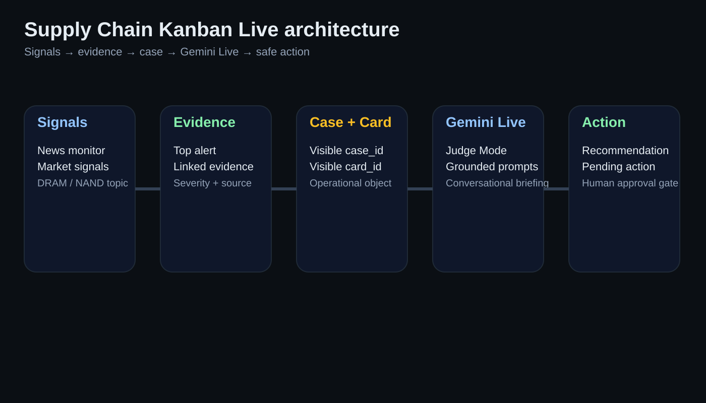
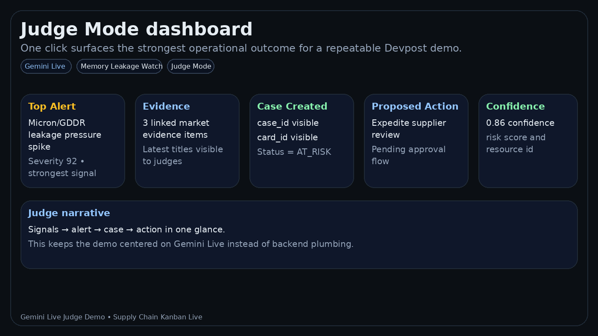
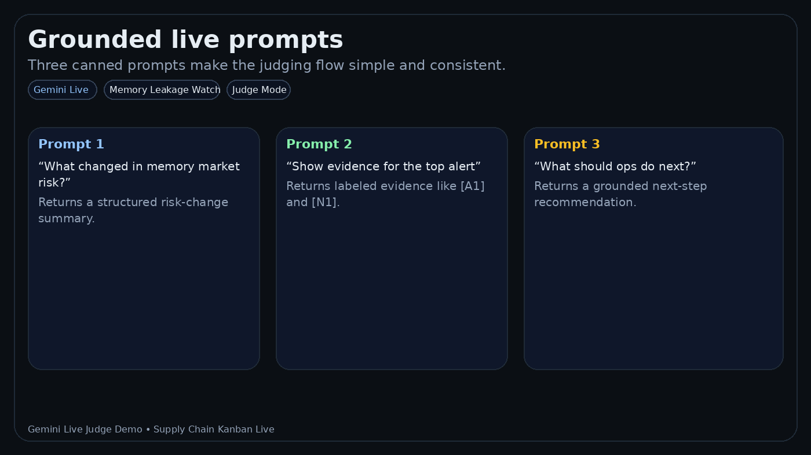

# Supply Chain Kanban Live — Gemini Live Agent for Supply-Chain Risk

**Supply Chain Kanban Live** is a runnable demo of a **Gemini Live-style operations agent** for AI infrastructure supply chains.
Instead of asking operators to click through fragmented dashboards, it gives them a single live briefing surface that can:

- detect emerging market shocks from memory/DRAM/NAND evidence
- ground every answer in recent alerts, news items, and case state
- create or update supply-chain cases and kanban cards
- recommend safe next actions with human approval still in the loop

This repo is designed for **repeatable judging**: today the demo works in a deterministic scaffold mode, and it also includes a Gemini Live bridge that can be upgraded to a real streaming session.

## Why this project exists

Supply-chain teams do not struggle because data is missing. They struggle because the data is fragmented across:

- market news
- supplier/operations signals
- cases and approvals
- action systems

Most tools still expose this as rows and dashboards. This project turns it into a **live, grounded agent workflow**:

**signals → evidence → alert → case → recommended action**

## What judges see

This demo centers the **Gemini Live operator experience**:

1. Run a deterministic **Memory Leakage Watch** scenario.
2. Watch alerts, evidence, cases, and cards appear.
3. Ask the agent what changed, what evidence supports it, and what ops should do next.
4. See a consistent grounded answer with citations and visible case/card IDs.

## Why Gemini Live

Gemini Live is a strong fit here because operators need a fast, conversational layer on top of changing evidence and operational state.

### Gemini Live adds value in this demo

- **Natural operator interface** — ask for a brief instead of hunting through screens
- **Grounded answers** — responses cite alerts, news, and case objects
- **Fast triage** — quickly move from “what changed?” to “what action should we take?”
- **Human-in-the-loop execution** — the system recommends and stages actions, while approvals remain explicit

### Current implementation posture

- **Today:** deterministic, Devpost-friendly scaffold + optional Gemini Live bridge
- **Next:** full streaming mic/audio session, richer tool calling, and tighter multimodal UX

## Judge flow

Open: `http://localhost:8080`

1. Click **Judge Mode**.
2. The app runs the memory shock scenario and refreshes alerts, evidence, cases, and cards.
3. The judge dashboard highlights:
   - Top Alert
   - Evidence
   - Case Created
   - Proposed Action
   - Confidence
4. Use one of the canned prompts:
   - “What changed in memory market risk?”
   - “Show evidence for the top alert”
   - “What should ops do next?”
5. Show the grounded answer and visible IDs for traceability.

## What this demo shows

- early detection of constraints using market + ops signals
- multi-agent case creation, scenario simulation, and ranked recommendations
- ontology-driven object model (orders / shipments / production / cases)
- a minimal Object Graph API (FastAPI)
- kinetic actions (execute typed actions, mock ERP connector, auditable action log)
- judge-facing web demo with deterministic Gemini Live-style interaction

## What this is not

- not a production deployment (no HA, no enterprise auth, no full RBAC model)
- not connected to real ERP/SAP/Oracle by default (uses a mock connector)
- not fully autonomous execution (human-in-the-loop is the default posture)

## Quick start

```bash
cp .env.example .env

# API + agent (no UI)
make demo

# Minimal (DB + API only)
make demo-min

# Optional: include Superset UI
make demo-ui

# Full demo (UI + agent) + smoke + checklist
make demo-all

# Gemini Live Agent demo
make demo-live
# open http://localhost:8080
```

- API docs: http://localhost:8000/docs
- Superset UI: http://localhost:8088 (admin credentials in .env)
- Demo walkthrough: `demo/README.md`
- Devpost script: `DEVPOST_3MIN_SCRIPT.md`
- Devpost draft copy: `DEVPOST_SUBMISSION_DRAFT.md`
- Gallery/storyboard assets: `docs/devpost_gallery/`

## Screenshots / gallery assets

The repo now includes a lightweight submission gallery in `docs/devpost_gallery/`:

- architecture overview
- judge mode dashboard
- top alert + evidence panel
- case/action traceability panel
- grounded live prompt examples
- 3-step operator flow

These assets are **submission storyboard graphics** for Devpost packaging. Replace them later with real runtime captures or a recorded GIF for the final submission video.







## Ontology

See:
- `contracts/supply_chain_ontology.yaml`
- `contracts/supply_chain_ontology.json`

These define:
- **Object types** (Order, Shipment, ProductionRecord, Case, Recommendation, Action, ...)
- **Relationships** (Shipment fulfills Order, Case targets Resource, ...)
- **Action types** (TriggerPurchase, ExpediteShipment, RebalanceAllocation, ...)

## Object Graph API (FastAPI)

The demo includes a minimal API surface:

- `GET /health`
- `GET /ontology` (`/json` / `/yaml`)
- `GET /objects/...` (order, shipment, production, resource)
- `GET /cases/...` (cases, recommendations, scenarios, actions)
- `GET /graph/neighbors?...` (lightweight graph expansion)
- `POST /actions/execute` (typed action execution + audit)

When you run Docker Compose, the API is exposed on port `8000`.

Health endpoints:
- `/healthz` (liveness, no DB)
- `/health` (DB connectivity)
- `/readyz` (DB + critical tables / views / extensions)

Error responses are standardized:
- JSON shape: `{"error": {"code", "message", "details"}, "request_id"}`
- Response header: `X-Request-Id` (echoed or auto-generated)

## Repo structure (simplified)

- `/demo` – runnable local demo (Docker + Python)
- `/agent_runtime` – DB schema, ingest, agents, Object Graph API, kinetic execution scaffold
- `/live_orchestrator` – Gemini Live scaffold/bridge and grounded prompt orchestration
- `/web_demo` – judge-facing demo UI
- `/news_monitor` – deterministic or RSS-backed news signal monitor
- `/seed` – schema + seed data + demo views
- `/signals` – market signal adapters
- `/dashboards` – board & crisis views
- `/governance` – audit & control artifacts
- `/contracts` – ontology + triggers (schema contracts)

## Audience

- supply chain leaders
- enterprise architects
- risk, audit, and compliance teams
- system integrators (SI)

## Version notes

### v0.1
Includes UI, Superset, Power BI, Slack alerts, Scenario Simulator.

### v0.5
Adds agent negotiation, auto-contract triggers, supplier portals, regulatory automation, crisis simulation.

### v0.9 — Agent Core (Runnable Demo)
A minimal, runnable AI-agent core for supply chain constraint detection.
